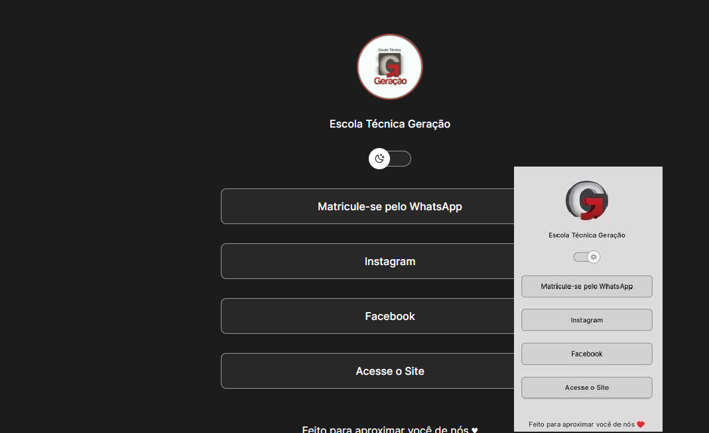

<h1 align="center"> Projeto Escolar </h1>

  

## 🚀 Tecnologias

Esse projeto foi desenvolvido com as seguintes tecnologias:

- HTML e CSS
- JavaScript
- Git e Github

## 💻 Projeto

O  PortalLins é um agregador de links para usar como cartão de visitas online.

Feito com ♥ by <a href="https://www.instagram.com/daniels.menezes_/?hl=pt-br">@daniels_Menezes</a> 👋
